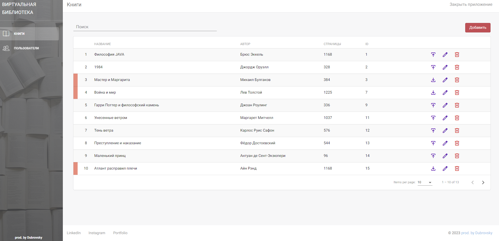
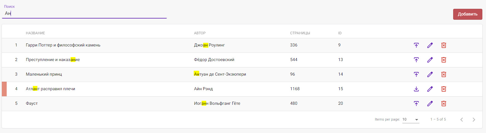
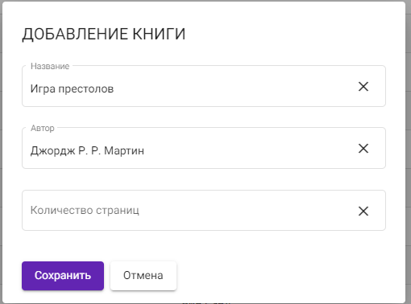
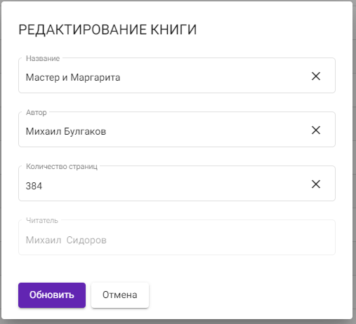
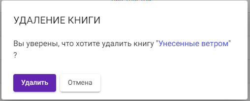
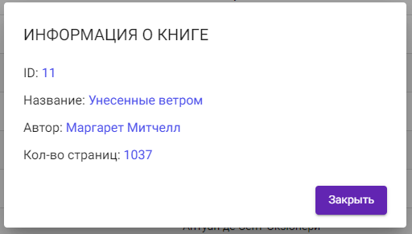
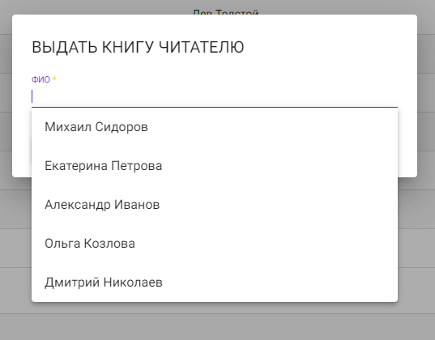
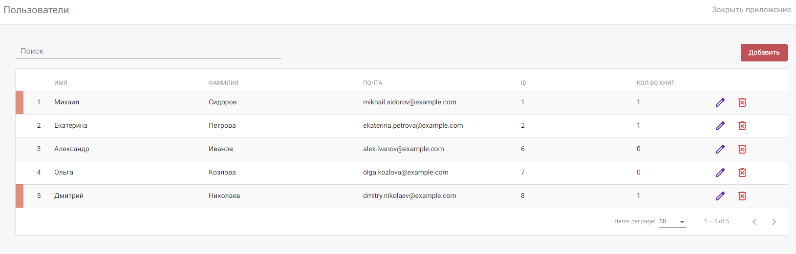
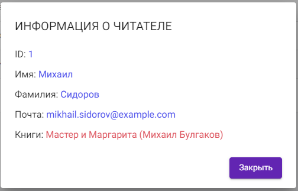

# Сервис онлайн библиотеки
Этот сервис предоставляет функционал для управления книгами и 
пользователями в библиотеке. Он имеет две основные страницы: 
"Книги" и "Пользователи", каждая из которых обладает функционалом 
поиска, добавления, редактирования и удаления объектов.
## Функционал страниц
#### Страница "Книги"

- **Поиск книг:** Позволяет искать книги по различным параметрам, таким как название, автор и т.д.

- **Добавление новой книги:** Возможность добавить новую книгу в библиотеку.

- **Редактирование книги:** Кнопка для изменения информации о книге.

- **Удаление книги:** Удаляет выбранную книгу из библиотеки.

- **Просмотр информации о книге:** Отображает подробную информацию о книге.

- **Присвоение книги пользователю:** Позволяет привязать книгу к определенному пользователю.

#### Страница "Пользователи"

- **Поиск пользователей:** Поиск пользователей по различным параметрам, таким как имя, фамилия и т.д.
- **Добавление нового пользователя:** Добавление нового пользователя в систему библиотеки.
- **Редактирование пользователя:** Изменение информации о пользователе.
- **Удаление пользователя:** Удаление выбранного пользователя из системы.
- **Просмотр информации о пользователе:** Подробная информация о пользователе и его арендованных книгах.

## Технологии
Сервис реализован с использованием следующих технологий:
- **Фронтенд:** Angular 14
- **Бэкенд:** Java, Spring Boot 3
- **Хранение данных:** Postgres

### Дополнительная информация
После каждого совершенного действия вверху страницы всплывает уведомление. 
Книги становятся просроченными спустя 30 дней с момента назначения книги читателю (показана красным цветом на скриншоте *"информация о читателе"*, также помечены пользователи у кого книга просрочена).

### Отказ от авторских прав (Copyright Disclaimer)
Этот проект создан исключительно в образовательных целях и для
расширения моего портфолио. В качестве основы был использован шаблон с сайта
https://www.creative-tim.com/product/light-bootstrap-dashboard-angular2,
который был адаптирован и изменен для нужд данного проекта.

Целью данного проекта является изучение и практическое
применение навыков разработки веб-приложений,
а также демонстрация умения работать с функционалом.

Весь исходный код, использованный шаблон и ресурсы были использованы 
исключительно в образовательных целях. Проект не претендует на коммерческое 
использование и является исключительно учебным проектом. 
Вся информация и ресурсы, взятые из других источников, 
будут надлежащим образом отмечены и защищены авторскими правами соответствующих владельцев.

This project was created solely for educational purposes and for
expanding my portfolio. The template from the website was used as a basis 
https://www.creative-tim.com/product/light-bootstrap-dashboard-angular2,
which was adapted and modified for the needs of this project.

The purpose of this project is to study and practice
application of web application development skills,
as well as demonstrating the ability to work with functionality.

All source code, template used and resources were used
for educational purposes only. The project does not pretend to be commercial
use and is purely an educational project.
All information and resources taken from other sources,
will be duly acknowledged and copyrighted by their respective owners.